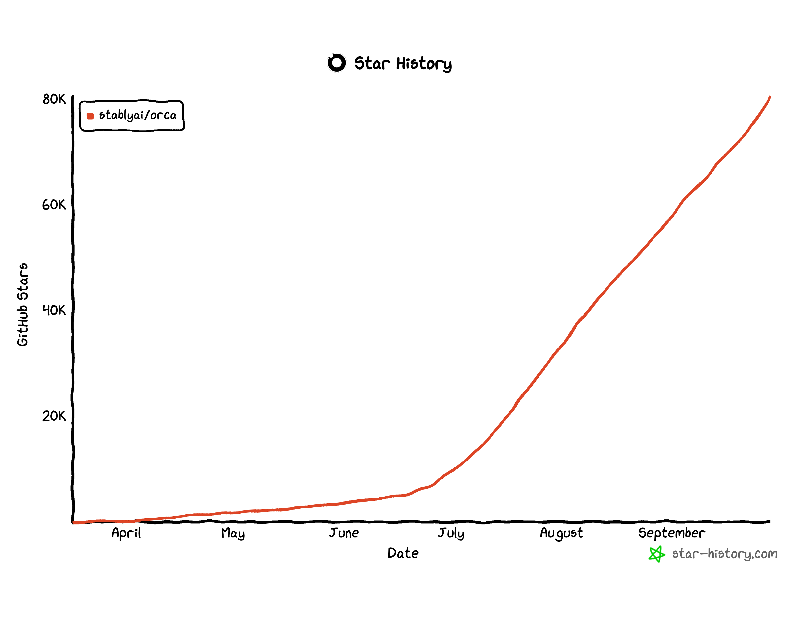

<h1 align="center">
  <a href="https://onOrca.dev"></a> Orca
</h1>

<p align="center">
  <a href="https://github.com/stablyai/orca"></a>
  <a href="https://github.com/stablyai/orca/releases"></a>
  
  <a href="https://discord.gg/fzjDKHxv8Q"></a>
  <a href="https://x.com/orca_build"></a>
  
</p>

<p align="center">
  <sub><a href="../../README.md">English</a> · <a href="README.zh-CN.md">中文</a> · <a href="README.ja.md">日本語</a> · <a href="README.es.md">Español</a> · <a href="README.fr.md">Français</a> · <a href="README.pt.md">Português</a></sub>
</p>

<p align="center">
  <strong>100x 빌더를 위한 AI 오케스트레이터.</strong><br/>
  Codex, Claude Code, OpenCode, Pi를 나란히 실행하세요. — 각 에이전트는 자체 worktree에서 실행되고 한곳에서 추적됩니다.
</p>

<h3 align="center"><a href="https://onorca.dev/download"><ins>Orca 다운로드</ins></a></h3>

<p align="center">
  
</p>

## 기능

<table>
<tr>
<td width="50%" valign="middle">

### 모바일 Companion

휴대폰에서 에이전트를 모니터링하고 조종하세요 — 에이전트가 완료되면 알림을 받고 어디서든 후속 지시를 보낼 수 있습니다.

[iOS App Store](https://apps.apple.com/us/app/orca-ide/id6766130217) · [Android APK 0.0.50](https://github.com/stablyai/orca/releases/download/mobile-android-v0.0.50/app-release.apk) · [문서 →](https://www.onorca.dev/docs/mobile)

</td>
<td width="50%">
  <a href="https://www.onorca.dev/docs/mobile"><picture><source srcset="../assets/feature-wall/mobile-companion-app-showcase.gif" type="image/gif"></picture></a>
</td>
</tr>
<tr>
<td width="50%" valign="middle">

### 병렬 Worktree

하나의 프롬프트를 다섯 에이전트에 동시에 보내세요. 각 에이전트는 격리된 자체 git worktree에서 실행됩니다 — 결과를 비교하고 가장 좋은 것을 머지하세요.

[문서 →](https://www.onorca.dev/docs/model/worktrees)

</td>
<td width="50%">
  <a href="https://www.onorca.dev/docs/model/worktrees"><picture><source srcset="../site/public/docs/tab-split.gif" type="image/gif"></picture></a>
</td>
</tr>
<tr>
<td width="50%" valign="middle">

### 터미널 분할

WebGL 렌더링, 무한 분할, 재시작 후에도 유지되는 스크롤백을 갖춘 Ghostty급 터미널.

[문서 →](https://www.onorca.dev/docs/terminal)

</td>
<td width="50%">
  <a href="https://www.onorca.dev/docs/terminal"><picture><source srcset="../../resources/onboarding/feature-wall/tile-02.gif" type="image/gif"></picture></a>
</td>
</tr>
<tr>
<td width="50%" valign="middle">

### 디자인 모드

실제 Chromium 창에서 UI 요소를 클릭하면 해당 HTML, CSS, 잘라낸 스크린샷이 에이전트 프롬프트로 바로 전송됩니다.

[문서 →](https://www.onorca.dev/docs/browser/design-mode)

</td>
<td width="50%">
  <a href="https://www.onorca.dev/docs/browser/design-mode"><picture><source srcset="../site/public/docs/orca-design-mode.gif" type="image/gif"></picture></a>
</td>
</tr>
<tr>
<td width="50%" valign="middle">

### GitHub &amp; Linear 네이티브

PR, issue, 프로젝트 보드를 앱 안에서 탐색하세요 — 어떤 작업에서든 worktree를 열고 컨텍스트 전환 없이 리뷰할 수 있습니다.

[문서 →](https://www.onorca.dev/docs/review/linear)

</td>
<td width="50%">
  <a href="https://www.onorca.dev/docs/review/linear"><picture><source srcset="../../resources/onboarding/feature-wall/tile-03.gif" type="image/gif"></picture></a>
</td>
</tr>
<tr>
<td width="50%" valign="middle">

### SSH Worktree

강력한 원격 머신에서 에이전트를 실행하세요. 파일 편집, git, 터미널을 모두 지원하며 자동 재연결과 포트 포워딩도 포함됩니다.

[문서 →](https://www.onorca.dev/docs/ssh)

</td>
<td width="50%">
  <a href="https://www.onorca.dev/docs/ssh"><picture><source srcset="../../resources/onboarding/feature-wall/tile-06.gif" type="image/gif"></picture></a>
</td>
</tr>
<tr>
<td width="50%" valign="middle">

### AI Diff 주석

diff의 어느 줄에든 코멘트를 남기고 에이전트에게 바로 보내세요 — Orca를 떠나지 않고 리뷰하고 수정하고 커밋할 수 있습니다.

[문서 →](https://www.onorca.dev/docs/review/annotate-ai-diff)

</td>
<td width="50%">
  <a href="https://www.onorca.dev/docs/review/annotate-ai-diff"><picture><source srcset="../site/public/docs/annotate-ai-diff.gif" type="image/gif"></picture></a>
</td>
</tr>
<tr>
<td width="50%" valign="middle">

### 에이전트로 파일 드래그

어디서나 자동 저장되는 VS Code 에디터 — 파일이나 이미지를 에이전트 프롬프트로 바로 드래그하세요.

[문서 →](https://www.onorca.dev/docs/editing/file-explorer)

</td>
<td width="50%">
  <a href="https://www.onorca.dev/docs/editing/file-explorer"><picture><source srcset="../../resources/onboarding/feature-wall/tile-07.gif" type="image/gif"></picture></a>
</td>
</tr>
<tr>
<td width="50%" valign="middle">

### Orca CLI

에이전트도 Orca를 조작할 수 있습니다 — `orca worktree create`, `snapshot`, `click`, `fill`로 모든 워크플로를 스크립팅하세요.

[문서 →](https://www.onorca.dev/docs/cli/overview)

</td>
<td width="50%">
  <a href="https://www.onorca.dev/docs/cli/overview"><picture><source srcset="../../resources/onboarding/feature-wall/tile-09.gif" type="image/gif"></picture></a>
</td>
</tr>
</table>

**그 밖에 기본으로 제공되는 기능:**

- **[빠른 열기](https://www.onorca.dev/docs/model/quick-open)** — 작업 흐름을 벗어나지 않고 worktree, 파일, 에이전트, 커맨드, 리포지토리 컨텍스트를 검색하세요.
- **[계정 전환 및 사용량 추적](https://www.onorca.dev/docs/agents/usage-tracking)** — Claude와 Codex의 사용량과 rate limit 초기화 시점을 확인하고, 다시 로그인하지 않고 계정을 바로 전환하세요.
- **[풍부한 리포지토리 미리보기](https://www.onorca.dev/docs/editing/markdown)** — Markdown, 이미지, PDF, 리포지토리 문서를 워크스페이스에서 미리 볼 수 있습니다.
- **[Computer Use](https://www.onorca.dev/docs/cli/computer-use)** — 워크플로에 실제 상호작용이 필요할 때 에이전트가 데스크톱 앱과 화면에 보이는 UI를 직접 조작하게 하세요.
- **[알림과 읽지 않음 상태](https://www.onorca.dev/docs/notifications)** — 에이전트가 완료되거나 주의가 필요할 때 알림을 받고, 스레드를 읽지 않음으로 표시해 나중에 다시 확인하세요.
- **그리고 훨씬 더 많은 기능** — 새로운 기능이 매일 출시되므로 이 목록은 늘 한 발 늦습니다. 진짜 기능은 [체인지로그](https://github.com/stablyai/orca/releases)에서 확인하세요.

---

## 지원 에이전트

**모든 CLI 에이전트**와 함께 작동합니다 — 터미널에서 실행되는 에이전트라면 Orca에서도 실행됩니다.

<p>
  <a href="https://docs.anthropic.com/claude/docs/claude-code"><kbd> Claude Code</kbd></a> &nbsp;
  <a href="https://github.com/openai/codex"><kbd> Codex</kbd></a> &nbsp;
  <a href="https://x.ai/cli"><kbd> Grok</kbd></a> &nbsp;
  <a href="https://cursor.com/cli"><kbd> Cursor</kbd></a> &nbsp;
  <a href="https://docs.github.com/en/copilot/how-tos/set-up/install-copilot-cli"><kbd> GitHub Copilot</kbd></a> &nbsp;
  <a href="https://dev.meta.ai/docs/muse-code"><kbd> Muse</kbd></a> &nbsp;
  <a href="https://deepseek-harness.github.io/deepseek-harness/"><kbd> DeepSeek Harness</kbd></a> &nbsp;
  <a href="https://zcode.z.ai/en/docs"><kbd> ZCode</kbd></a> &nbsp;
  <a href="https://opencode.ai/docs/cli/"><kbd> OpenCode</kbd></a> &nbsp;
  <a href="https://mimo.xiaomi.com/coder"><kbd> MiMo Code</kbd></a> &nbsp;
  <a href="https://ampcode.com/manual#install"><kbd> Amp</kbd></a> &nbsp;
  <a href="https://openclaude.gitlawb.com/"><kbd> OpenClaude</kbd></a> &nbsp;
  <a href="https://antigravity.google/docs/cli-overview"><kbd> Antigravity</kbd></a> &nbsp;
  <a href="https://pi.dev"><kbd> Pi</kbd></a> &nbsp;
  <a href="https://omp.sh"><kbd> oh-my-pi</kbd></a> &nbsp;
  <a href="https://hermes-agent.nousresearch.com/docs/"><kbd> Hermes Agent</kbd></a> &nbsp;
  <a href="https://devin.ai/cli"><kbd> Devin</kbd></a> &nbsp;
  <a href="https://block.github.io/goose/docs/quickstart/"><kbd> Goose</kbd></a> &nbsp;
  <a href="https://docs.augmentcode.com/cli/overview"><kbd> Auggie</kbd></a> &nbsp;
  <a href="https://github.com/autohandai/code-cli"><kbd> Autohand Code</kbd></a> &nbsp;
  <a href="https://github.com/charmbracelet/crush"><kbd> Charm</kbd></a> &nbsp;
  <a href="https://docs.cline.bot/cline-cli/overview"><kbd> Cline</kbd></a> &nbsp;
  <a href="https://www.codebuff.com/docs/help/quick-start"><kbd> Codebuff</kbd></a> &nbsp;
  <a href="https://freebuff.com/cli"><kbd> Freebuff</kbd></a> &nbsp;
  <a href="https://commandcode.ai/docs/quickstart"><kbd> Command Code</kbd></a> &nbsp;
  <a href="https://docs.continue.dev/guides/cli"><kbd> Continue</kbd></a> &nbsp;
  <a href="https://docs.factory.ai/cli/getting-started/quickstart"><kbd> Droid</kbd></a> &nbsp;
  <a href="https://kilo.ai/docs/cli"><kbd> Kilocode</kbd></a> &nbsp;
  <a href="https://www.kimi.com/code/docs/en/kimi-code-cli/getting-started.html"><kbd> Kimi</kbd></a> &nbsp;
  <a href="https://kiro.dev/docs/cli/"><kbd> Kiro</kbd></a> &nbsp;
  <a href="https://github.com/mistralai/mistral-vibe"><kbd> Mistral Vibe</kbd></a> &nbsp;
  <a href="https://github.com/QwenLM/qwen-code"><kbd> Qwen Code</kbd></a> &nbsp;
  <a href="https://support.atlassian.com/rovo/docs/install-and-run-rovo-dev-cli-on-your-device/"><kbd> Rovo Dev</kbd></a> &nbsp;
  <kbd>+ any CLI agent</kbd>
</p>

---

## 설치

### 데스크톱 — macOS, Windows, Linux

- **[onOrca.dev에서 다운로드](https://onorca.dev/download)**
- 또는 빌드를 직접 받기: [macOS Apple Silicon](https://github.com/stablyai/orca/releases/latest/download/orca-macos-arm64.dmg) · [macOS Intel](https://github.com/stablyai/orca/releases/latest/download/orca-macos-x64.dmg) · [Windows (.exe)](https://github.com/stablyai/orca/releases/latest/download/orca-windows-setup.exe) · [Linux AppImage](https://github.com/stablyai/orca/releases/latest/download/orca-linux.AppImage) · [전체 빌드](https://github.com/stablyai/orca/releases/latest)
- headless Linux 서버에서 `orca serve`를 실행하시나요? [Headless Linux 서버 가이드](../reference/headless-linux-server.md)를 확인하세요.

_또는 패키지 매니저로 설치:_

```bash
# macOS (Homebrew)
brew install --cask stablyai/orca/orca

# Arch Linux (AUR) — or stably-orca-git to build from source
yay -S stably-orca-bin
```

### 모바일 Companion — iOS, Android

데스크톱 앱과 페어링해 휴대폰에서 에이전트를 모니터링하고 조종하세요.

- **iOS:** [App Store에서 다운로드](https://apps.apple.com/us/app/orca-ide/id6766130217)
- **Android:** [APK 0.0.50 다운로드](https://github.com/stablyai/orca/releases/download/mobile-android-v0.0.50/app-release.apk) · [설치 가이드](https://www.onorca.dev/docs/android-apk)

---

## 커뮤니티와 지원

- **Discord:** **[Discord](https://discord.gg/fzjDKHxv8Q)** 커뮤니티에 참여하세요.
- **Twitter / X:** 업데이트와 공지는 **[@orca_build](https://x.com/orca_build)** 를 팔로우하세요.
- **WeChat:** QR 코드를 스캔해 Orca 커뮤니티 WeChat 그룹 10에 참여하세요.

  

- **피드백과 아이디어:** 우리는 빠르게 출시합니다. 필요한 기능이 있나요? [새 기능을 요청](https://github.com/stablyai/orca/issues)하세요.
- **개인정보 보호:** Orca가 수집하는 익명 사용 데이터와 수집 거부 방법은 [개인정보 및 텔레메트리 문서](https://www.onorca.dev/docs/telemetry)를 참고하세요.
- **응원하기:** 이 리포지토리에 [Star](https://github.com/stablyai/orca)를 눌러 매일 공개되는 릴리스 소식을 확인해 주세요.

---

## 개발

기여하거나 로컬에서 실행하고 싶으신가요? [CONTRIBUTING.md](../../.github/CONTRIBUTING.md) 가이드를 확인하세요.

<a href="https://github.com/stablyai/orca/graphs/contributors">
  
</a>

<p align="center">
  
</p>

## 서명된 빌드

Windows 코드 서명은 [SignPath.io](https://signpath.io)가 후원·제공하며, 인증서는 [SignPath Foundation](https://signpath.org)에서 제공합니다.

## 라이선스

Orca는 [MIT 라이선스](../../LICENSE)에 따라 자유롭게 사용할 수 있는 오픈 소스입니다.
